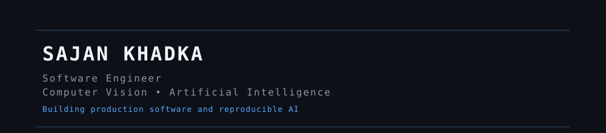

<div align="center">
  
  <br />
  
</div>

<h1 align="center">Sajan Khadka</h1>

<p align="center">
  <b>Software Engineer</b> • <b>Computer Vision</b> • <b>Artificial Intelligence</b>
</p>

<p align="center">
  <b>Building production-grade software systems and reproducible AI for real-world impact.</b>
</p>

<br />

---

## About

Software Engineer with 3+ years of experience designing, developing, deploying, and maintaining enterprise software systems across healthcare, enterprise resource planning (ERP), telecommunications, workflow automation, and AI-assisted platforms. My work focuses on scalable backend architecture, distributed systems, cloud infrastructure, DevOps, and production operations, complemented by research in computer vision, efficient deep learning, and explainable AI for resource-constrained environments.

---

## Professional Snapshot

<table>
<tr>
<td align="center" width="25%">
  <h3>Experience</h3>
  <p>3+ Years</p>
</td>
<td align="center" width="25%">
  <h3>Domains</h3>
  <p>Healthcare</p>
  <p>ERP</p>
  <p>Automation</p>
</td>
<td align="center" width="25%">
  <h3>Research</h3>
  <p>Computer Vision</p>
  <p>Explainable AI</p>
</td>
<td align="center" width="25%">
  <h3>Current Focus</h3>
  <p>Research Engineering</p>
  <p>Applied AI</p>
  <p>PhD Preparation</p>
</td>
</tr>
</table>

---

## Core Expertise

### Software Engineering

- Backend Architecture & Enterprise Software Development
- Distributed Systems & System Integration
- REST API Design & Development
- Workflow Automation & Queue-Based Processing
- Database Design, Optimization & Performance Engineering
- Authentication, Authorization & Multi-Tenant Architecture
- Production Operations & Deployment

### Infrastructure

- Docker, Linux, Nginx, Redis
- CI/CD & Automation
- Production Operations & Monitoring

### Research Engineering

- Computer Vision & Medical Image Analysis
- Explainable AI (Grad-CAM, Saliency Maps)
- Efficient Deep Learning & Model Compression
- Transfer Learning & Quantization
- Reproducible ML Pipelines & Experiment Tracking

### Engineering Practices

- Clean Architecture & SOLID Principles
- Service-Oriented & Event-Driven Design
- Repository & Service Layer Patterns
- API Versioning & Documentation
- Queue-Driven & Scheduled Processing
- Testable & Maintainable Code
- Database Performance Optimization
- CI/CD & Automated Deployments

---

## Technology Stack

<p align="center">
  
</p>

<p align="center">
  <sub>Backend • AI/ML • Databases • Infrastructure</sub>
</p>

---

## Research Interests

- Computer Vision
- Explainable AI (XAI)
- Medical Image Analysis
- Efficient Deep Learning
- Model Compression & Quantization
- Trustworthy AI
- Edge AI
- AI Systems Engineering

---

## Research Philosophy

I am interested in building AI systems that are not only accurate but also efficient, interpretable, reproducible, and deployable in real-world environments.

---

## Engineering Philosophy

I enjoy designing maintainable software systems that prioritize scalability, reliability, observability, and long-term maintainability. I believe good engineering balances clean architecture, operational simplicity, and measurable business impact.

---

## Selected Engineering Projects

### Enterprise M2M Connectivity Platform (Germany)

Designed and maintained backend services for an enterprise-scale Machine-to-Machine connectivity management platform used by a large organization in Germany. Unified enterprise SIM lifecycle management across four telecommunications providers into a centralized platform supporting customer, dealer, subscription, usage monitoring, billing preparation, and operational reporting.

- Enterprise Laravel backend architecture
- Integration with multiple telecom provider REST APIs
- Unified SIM lifecycle management
- Automated synchronization pipelines with Cron and Redis queues
- Third-party API integrations with retry mechanisms and error recovery
- Dealer, customer, and subscription management
- Usage monitoring and billing preparation dashboards
- Historical audit trails and reporting
- PostgreSQL optimization for high-volume datasets
- Secure API authentication and middleware
- Dockerized deployment on Linux

**Stack:** Laravel · PHP · PostgreSQL · Redis · Docker · REST APIs · Linux · Nginx

---

### Enterprise ERP Platform

Contributed to the design, implementation, and maintenance of enterprise ERP modules supporting business operations across finance, payroll, human resources, attendance, approvals, and reporting.

- Multi-module ERP backend architecture
- Payroll processing and financial accounting
- HR management, attendance, and leave tracking
- Configurable approval chains with multi-step transitions
- Notification engine with channel abstraction
- Queue-driven background processing and event-driven architecture
- Role-based access control and multi-tenant architecture
- Reporting and analytics with query optimization
- Database indexing and performance tuning

**Stack:** Laravel · PHP · PostgreSQL · Redis · Docker · Linux · Nginx

---

### WHO-Backed Ethics Review Platform

Developed secure web applications supporting institutional research ethics review workflows for healthcare organizations, emphasizing compliance, auditability, and secure document management.

- Secure protocol submission with granular permission controls
- Multi-stage review workflow with committee assignment
- Role-based access control and audit logging
- Encrypted document storage and secure file handling
- Email notifications and workflow state management
- International compliance requirements for research ethics

**Stack:** React · Django REST Framework · PostgreSQL · Docker

---

### AI-Powered Tender Platform

Built AI-assisted backend services for intelligent document processing and collaborative tender management.

- LLM integration for automated document extraction and analysis
- FastAPI microservices for document processing pipeline
- Background processing with queue-based architecture
- Real-time collaboration via WebSocket connections
- Role-based access control for multi-tenant use
- RESTful API design and Docker deployment

**Stack:** Python · FastAPI · NextJS · PostgreSQL · Docker · Nginx

---

### Stock Forecasting System

Time series forecasting and analysis system for financial market data, implementing end-to-end ML pipeline from feature engineering to model evaluation.

- Time series forecasting with statistical and deep learning models
- Feature engineering on financial market data
- Model evaluation and comparison framework
- Visualization of predictions and historical trends
- Reproducible experiment pipeline

**Stack:** Python · TensorFlow · Pandas · Matplotlib

---

## Research

### Current Research

**Memory-Efficient and Explainable Deep Learning Framework for Pneumonia Detection from Chest X-Ray Images Using a Quantized EfficientNet-B0**

Research Focus

Developing computationally efficient and explainable deep learning methods for pneumonia detection from chest X-ray images.

Methodology

- EfficientNet-B0
- Transfer Learning
- Static & Dynamic INT8 Quantization
- Grad-CAM++
- Bootstrap Confidence Intervals
- External Validation (RSNA)

Key Results

```
ROC-AUC  ............. 0.9678
Accuracy  ............ 91.83%
Sensitivity  ......... 96.67%
Model Size  .......... 17.66 → 5.13 MB
Latency  ............. ~120 → ~15 ms
Peak Memory .......... 979 → 164 MB
```

**Current Status:** Under supervisor review. Code and documentation to be released upon approval.

---

### Research Repositories

| Repository | Description | Status |
|:-----------|:------------|:-------|
| [Pneumonia-EfficientNet-XAI](https://github.com/sajan-ft9/pneumonia-efficientnet-xai) | Explainable pneumonia detection on chest X-rays | Active |
| [Stock-Forecasting-NEPSE](https://github.com/sajan-ft9/stock-forecasting-nepse) | Time series forecasting for Nepali stock market | Active |
| [Research-Toolkit](https://github.com/sajan-ft9/research-toolkit) | Reusable ML pipeline and experiment tracking utilities | Planned |

---

## Academic Work

| Year | Degree | GPA | Thesis | Institution |
|:-----|:-------|:----|:-------|:------------|
| 2026 (Expected) | Master of Information Technology | 3.33/4.00 | Memory-Efficient and Explainable Deep Learning Framework for Pneumonia Detection from Chest X-Ray Images Using a Quantized EfficientNet-B0 | Tribhuvan University |
| 2023 | Bachelor of Computer Engineering | 3.13/4.00 | Stock Forecasting for Nepali Stock Market using Machine Learning | Khwopa Engineering College |

---

## Open Source

Open-source projects under active development:

- **EfficientNet-XAI** — Model quantization and explainability toolkit
- **Research Toolkit** — Reusable ML pipeline and experiment tracking utilities
- **Experiment Tracker** — Lightweight experiment logging for research
- **Engineering Case Studies** — Enterprise architecture, system design, performance optimization, PostgreSQL tuning, Laravel architecture

---

## Current Work

| Project | Status |
|:--------|:-------|
| Master's Thesis | Final Review |
| Journal Publication | Preparing Manuscript |
| Research Toolkit | Planning |
| PhD Applications | Preparing |

---

## Roadmap

```text
☐ Release Master Thesis Code & Documentation
☐ Publish ML Research Toolkit (Open Source)
☐ Write Engineering Case Studies (System Design)
☐ Open Source Contributions to established projects
```

## GitHub Statistics

<div align="center">
  
  <br /><br />
  
  <br /><br />
  
</div>

---

## Connect

<p align="center">
  <a href="mailto:sajankhad2@gmail.com"><b>Email</b></a> •
  <a href="https://linkedin.com/in/sajan-khadka-ft9"><b>LinkedIn</b></a> •
  <a href="https://scholar.google.com/citations?user=qNlepR0AAAAJ"><b>Google Scholar</b></a> •
  <a href="https://orcid.org/0009-0001-6576-877X"><b>ORCID</b></a> •
  <a href="https://sajan-ft9.github.io"><b>Resume</b></a>
</p>

---

<p align="center">
  <sub>Interested in building reliable software systems and advancing trustworthy artificial intelligence through engineering and research.</sub>
</p>
